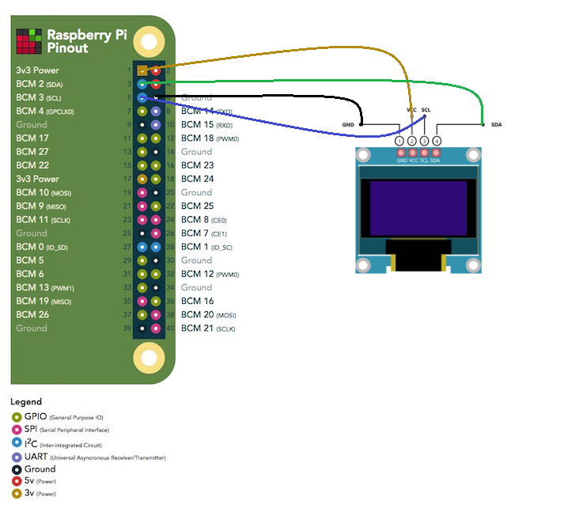

# Oled Display IP
This project utilizes ssd1306 oled display to display your embedded linux kit's local IP address, raspberry pi 4 in my case, on start up.
<div style="text-align:center; width:50%">
    
</div>


## How-to 

### 1- Wiring
For raspberry pi pinout you may check https://pinout.xyz/ 
<!-- WIRING DIAGRAM -->
<div style="text-align:center; width:50%">
    
</div>

### 2- Enable RPi i2c interface
You can use the raspi-config tool to enable the I2C interface.
```bash
sudo raspi-config # Interfacing Options > I2C > Yes
sudo reboot 
```
OR, You may append a Device Tree Overlay to /boot/config.txt file to configure the I2C interface. 
```bash
echo "dtoverlay=i2c1" | sudo tee -a /boot/config.txt
sudo reboot
```

### 3- Install Dependencies

**os packages**
```bash
sudo apt install net-tools      # for `ifconfig`
sudo apt install wireless-tools # for `iwgetid`
```
**python dependencies**
```bash    
python -m pip install --upgrade pip setuptools wheel
pip install Adafruit-SSD1306    
pip install pillow
```
### 4- You are ready to run

```bash
git clone https://github.com/AladdinT/oled-display-ip.git
```

```bash
cd oled-display-ip/     # go to script directory
./oled-display-ip.sh    # run the script
```

## Set up a systemd service
A systemd service file `my-display-ip.service` is included to automate execution of the script at system start up.

In order to run script at start up, follow these steps line by line:

```bash
# Update file ExecStart, and ExecStop with your paths, and parameters
nano ./systemd-service/my-display-ip.service
# Copy the systemd service file to the appropriate systemd service directory
sudo cp ./systemd-service/my-display-ip.service /usr/lib/systemd/system/
# Reload the systemd manager to recognize the new service file
sudo systemctl daemon-reload
# Enable the service to start automatically at boot
sudo systemctl enable   my-display-ip.service
# Start the service to immediately run
sudo systemctl start    my-display-ip.service
# Check Service Status
sudo systemctl status   my-display-ip.service
```
## Undo changes

### turn off oled display
```bash
./oled-stop.py 
```

### Disable i2c interface
If enabled using `raspi-config` tool
```bash
sudo raspi-config # Interfacing Options > I2C > NO
```

If enabled using device tree overlay `dtoverlay` 
```bash
sudo nano /boot/config.txt # remove or comment this line `dtoverlay=i2c1`
```

### Remove systemd service
```bash
# To stop the service from running automatically on boot
sudo systemctl disable my-display-ip.service
# To remove the service from systemd
sudo rm /usr/lib/systemd/system/my-display-ip.service
sudo systemctl daemon-reload
```

